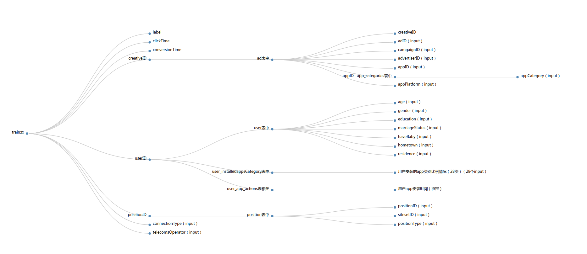

# pre

## 一个训练条目




```
!label
!clickTime
!conversionTime

!creativeID
!!ad表中
!!!creativeID
!!!adID（input）
!!!camgaignID（input）
!!!advertiserID（input）
!!!appID（input）
!!!appPlatform（input）

!userID
!!user表中
!!!age（input）
!!!gender（input）
!!!education（input）
!!!marriageStatus（input）
!!!haveBaby（input）
!!!hometown（input）
!!!residence（input）
!!user_installedappsCategory表中
!!!用户安装的app类别比例情况（28类）（28个input）
!!user_app_actions表相关
!!!用户app安装时间（待定）

!positionID
!!position表中
!!!positionID（input）
!!!sitesetID（input）
!!!positionType（input）

!connectionType（input）
!telecomsOperator（input）
```